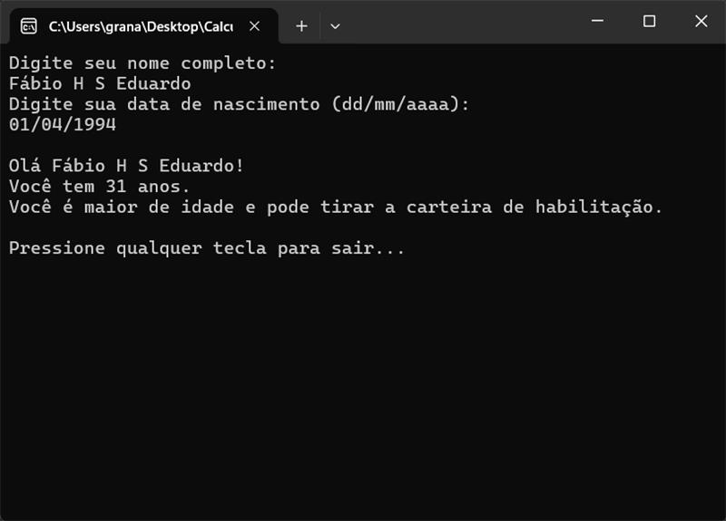
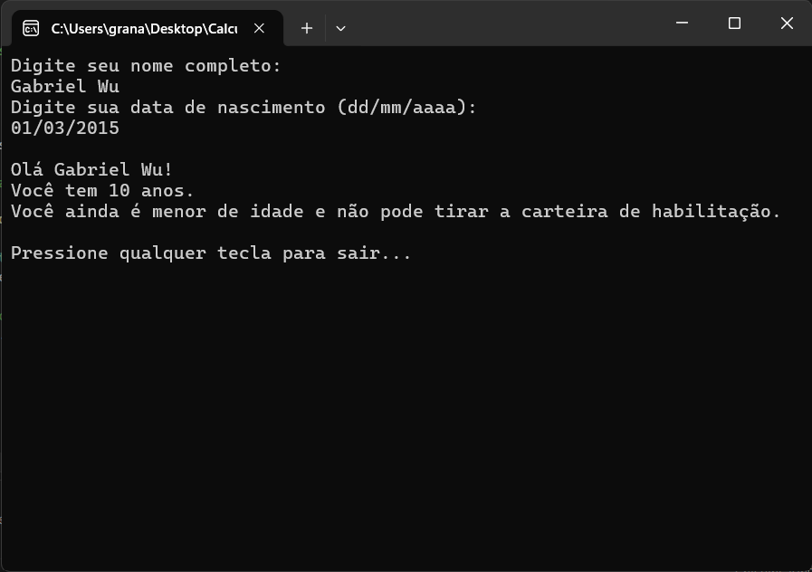

# Calcular idade - CP1
 
## Turma
- 2TDSPA
 
## Integrantes
- Fábio Henrique de Souza Eduardo — RM: 560416  
- Gabriel Wu Castro — RM: 560210  
- Renato Kenji Sugaki — RM: 559810  
 
---
 
## Descrição
Este projeto consiste em uma aplicação que **calcula a idade de uma pessoa** e roda via console desenvolvida em **C# no Visual Studio 2022**.  
 
A aplicação permite calcular a idade de uma pessoa.
 
---
 
## Funcionalidades
- Campo para inserir nome completo
- Campo para inserir data de nascimento
 
---
 
## Tecnologias Utilizadas
- Linguagem: **C#**  
- IDE: **Visual Studio 2022**  
 
---
 
## Console
**Resultado caso for maior de idade**

**Resultado caso for menor de idade**

 
---
 